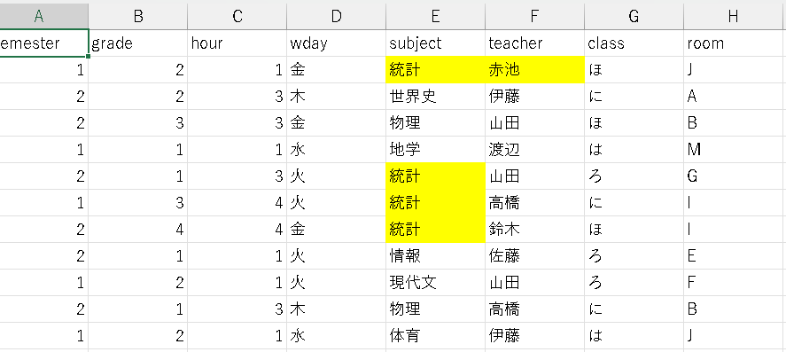
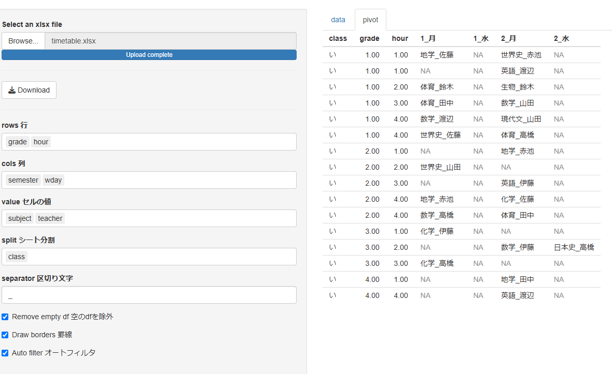
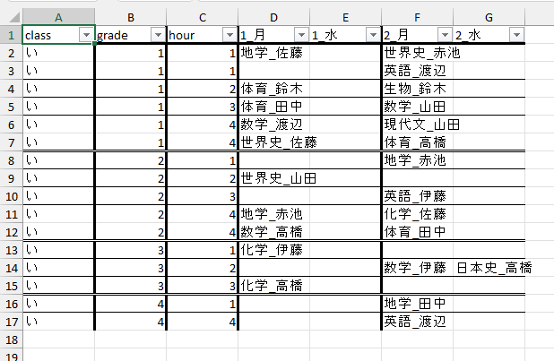

# convex: for Convenient Excel

エクセルの便利ツールを提供する予定です． 2025年2月時点では，以下の機能があります．

-   セルの強調表示   
-   文字列のピボットテーブル   

強調表示では，エクセルのシートに簡単に強調表示(塗りつぶし)を設定できます． 「強調文字」にセミコロンかカンマ区切りで入力した文字列を含むセルに対して，設定した「色」を着色できます． 複数ファイル，複数シートにも対応しています． 一度設定した後に，別のファイル，別の文字列，別の色で設定するときは，再読み込み(F5)してください．

文字列のピボットテーブルは，文字列をピボットテーブルのように扱うものです． エクセルでのピボットテーブルでは，データの個数や平均値の計算などはできますが，文字列そのものをセルの値に使うことはできません． 時間割やアルバイトのシフトなどに役立つかもしれません．

convex is planned to provide useful tools for Excel. On February 2025, the following functions are available.

-   Cell highlighting   
-   Pivot table of strings   

Highlighting allows you to easily set highlighting (fill) cells on Excel sheets. Cells containing strings entered as semi-colons or comma-separated characters in the "Highlighting string" field can be coloured with a set "Highlighting colour". Multiple files and sheets are supported. To set new different file(s), different strings or different colour after setting once, reload the file (F5).

A string pivot table treats a string as if it were a pivot table. Pivot tables in Excel can be used to calculate the number of data, averages, etc., but they cannot use strings themselves as cell values. This may be useful for timetables, part-time work shifts, etc.

## Use on web

次ののURLで使用できます． You can use web app.

<https://matutosi.shinyapps.io/convex/>

注意

- 使用したデータはセッション終了後に削除されるはずですが，機密情報は使用しないほうが良いかもしれません．   
- 使用時間の制限が月ごとにありますので，突然しようできないことがあるかもしれません．その場合は，Rをインストールして自分のパソコンで実行することをオススメします．   

Note

- Input data will be deleted at the end of the session, but recommended not to use sensitive information.   
- Because of monthly limit, you may not be able to use it suddenly. In that case, I recommend that you install R and run it on your own computer.   

## Use on your PC

Rをインストールしているときは，自分のパソコンでも実行できます．

You can use with R on your PC.

```         
  # install.packages(shiny)
shiny::runGitHub("matutosi/convex", subdir = "R")
```

## How to use Highlighting

-   「highlight」のタブをクリックし，左側の「Select xlxs file(s)」の下にある「Browse」をクリック   
-   Click "hilight" tab and click "Browse" under "Select xlxs file(s)"   
       

-   対象のファイルを選択(複数可)   
-   Select file(s)   
       

-   強調したいセルに含まれる文字列を「強調文字」に入力．複数のときは，半角のセミコロンかカンマで区切る．色を変更したいときは，"Highlighting color"をクリック．   
-   Input "Highlighting string". If multiple strings, separate with ';' or ','. To change color, click "Highlighting color".   
       

-   「Download」をクリック．複数ファイルのときは，zip形式になるので，解凍する．   
-   Click "Download". Multiple files will be ziped.   

-   入力した文字列が強調表示される．   
-   Cells containing highlighting strings are highlighted.   
    

## How to use Pivot

-   「pivotea」のタブをクリックし，左側の「Select xlxs file(s)」の下にある「Browse」をクリック   
-   Click "pivotea" tab and click "Browse" under "Select xlxs file(s)"   
       

-   対象のファイルを選択(1つのみ)．   
-   Select ONE file   
       

-   「data」に1つ目のシートのデータが表示されるので，内容を確認可能．行，列，セルの値，シート分割にそれぞれ列名を入力．"区切り文字列は"セルの値に複数入力するときの区切りとして使用．   
-   Input data in the first sheet will be shown in "data" tab, so you can check contents. Input rows, cols, values and split (sheet). "separater" will be used for multiple cell values.   
       

-   **便利機能**：エクセルの2つ目以降のシートに「setting_for_pivotea」という名前で行，列，セルの値，シート分割の値を保存しておくと，その設定を自動的に使用可能．    
-   **usefull feature**: Save the values for rows, columns, cells and sheet divisions in the second or later sheet named 'setting_for_pivotea', to use the settings automatically.   
       

-   「pivot」タブを選択するとピボット後の結果が表示される(シート分割しているときは，1シート目)   
-   Pivoted table will be shown in "pivot" tab (first sheet when using split).   
       

-   「Download」をクリック．なお，「罫線」をチェックすると項目ごとに罫線が入り，「オートフィルタ」をチェックするとオートフィルタが設定される．   
-   Click "Download". You can use "border" and "autofilter" by checking button.    
       

## Citation 引用

松村 俊和 (2024) RとShinyを使ったエクセル便利ツール．<https://matutosi.shinyapps.io/convex/> .

Toshikazu Matsumura (2023) convex: for Convenient Excel. <https://matutosi.shinyapps.io/convex/> .
