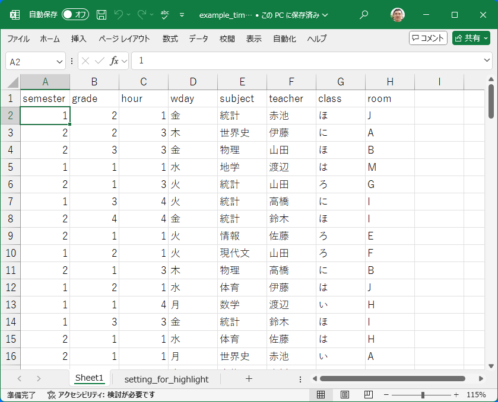
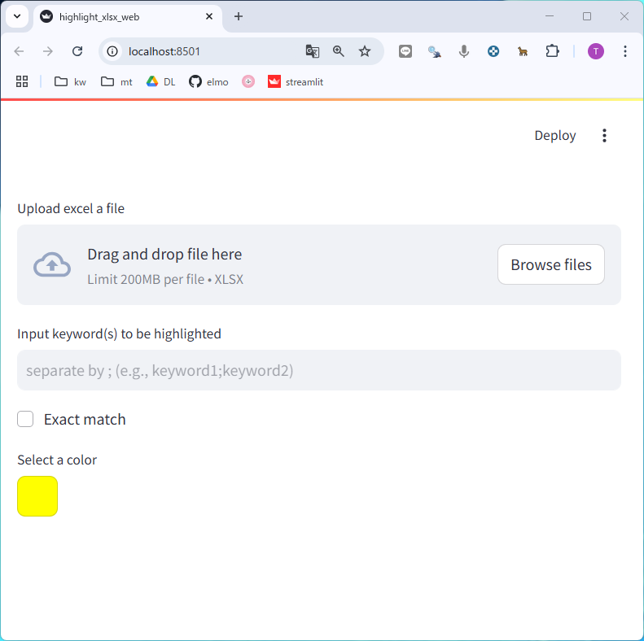
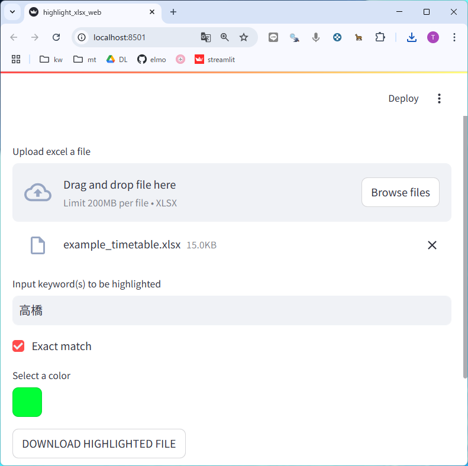
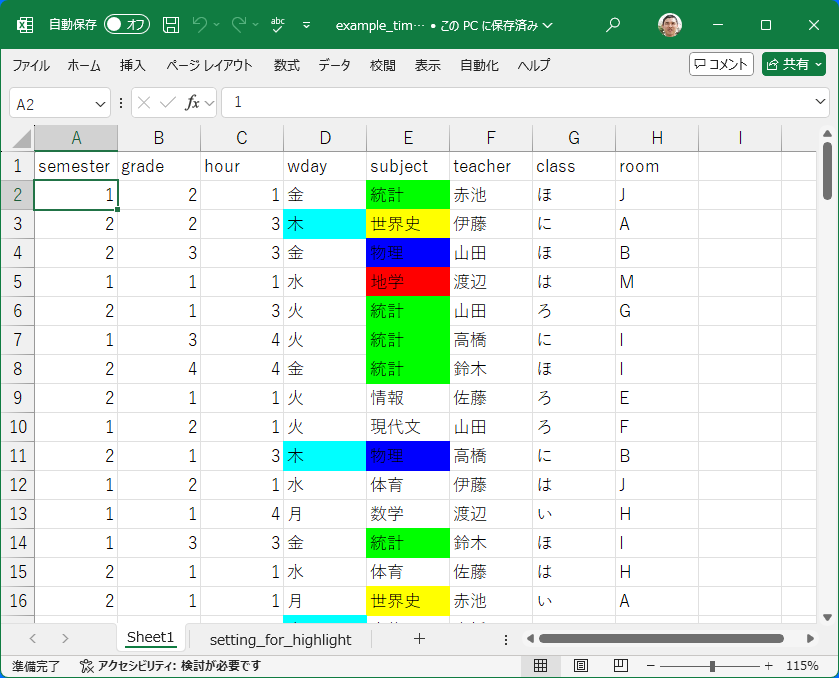

# convex: highlight with strings

エクセルの便利ツールを提供する予定です． 
RとShinyを使ったバージョン(ピボットテーブル・ハイライト)は以下をご覧ください．

I will provide a convenient tool for Excel. 
Please see the following URL for the version using R and Shiny (pivot table and highlight).

- https://github.com/matutosi/convex  

## Use on web with streamlit

- https://highlight-xlsx.streamlit.app/  

Pythonのstreamlitを使って，web上でハイライトを利用できます．
設定用のシートを用意することで，複数列の文字列を個別の色で強調表示できます．

注意

- 使用したデータは一定期間経過後に削除されるはずですが，機密情報は使用しないほうが良いかもしれません．   
- 使用時間の制限が月ごとにありますので，突然しようできないことがあるかもしれません．その場合は，Pythonをインストールして自分のパソコンで実行することをオススメします．   

Note

- The data used should be deleted after a certain period of time, but it may be better not to use confidential information.
- There is a time limit for use every month, so you may suddenly not be able to use it. In that case, I recommend installing Python and running it on your own computer.


## Use on your PC

Pythonをインストールしているときは，自分のパソコンでも実行できます．

If you have installed Python, you can run it on your own computer.

```
pip install -r requirements.txt
```

```{Python}
streamlit run highlight_xslsx_web.py
```

## How to use Highlighting

- https://highlight-xlsx.streamlit.app/  


- もとのエクセルのデータ  
- excel data before highlighting  
       

- (任意) 「setting_for_highlight」というシートに強調したい文字列(keywords)と背景色(colors)を入力可能です
-  (optional) You can enter keywords and colors in the sheet named "setting_for_highlight".
       

- 「Browse file」からエクセルのファイルを選択します．
- Select an Excel file from "Browse file".
       

- 「Input keywords(s) to be highlighted」の下に強調したい文字列を入力します．複数の場合は，「;」(セミコロン)で区切ってください．
- Enter the strings you want to highlight below "Input keywords(s) to be highlighted". If there are multiple strings, separate them with ";" (semicolon).
       

- 「DOWNLOAD HIGHLIGHTED FILE」で強調表示されたエクセルファイルをダウンロードできます．  
- You can download the highlighted Excel file by clicking "DOWNLOAD HIGHLIGHTED FILE".
       


## Citation 引用

松村 俊和 (2025) Pythonとstreamlitを使ったエクセル便利ツール．<https://highlight-xlsx.streamlit.app/> .

Toshikazu Matsumura (2025) convex: for Convenient Excel with Python and streamlit. <https://highlight-xlsx.streamlit.app//> .
